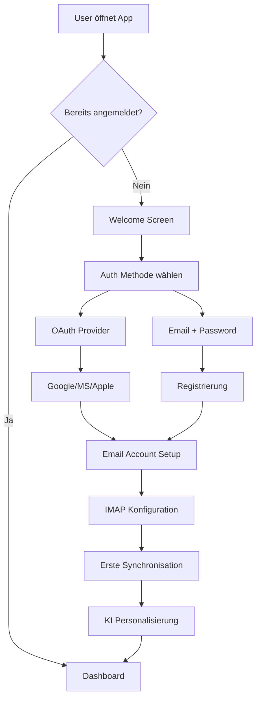
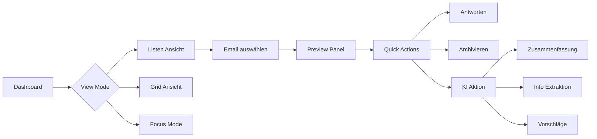
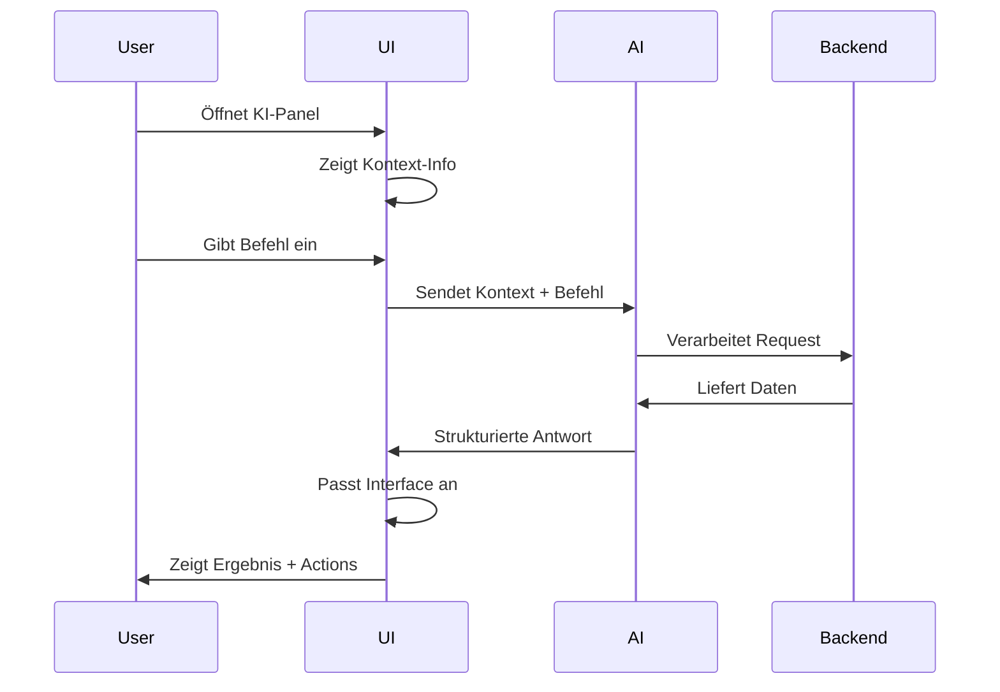
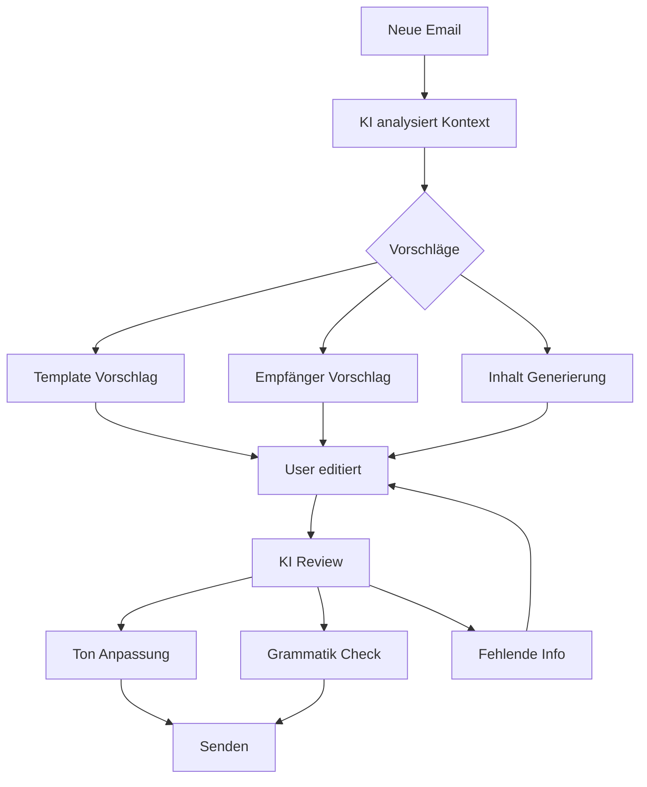
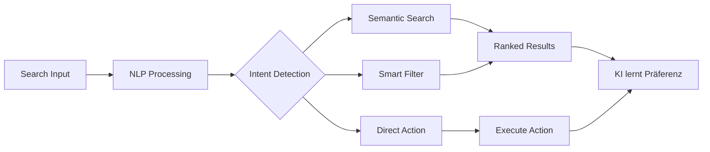
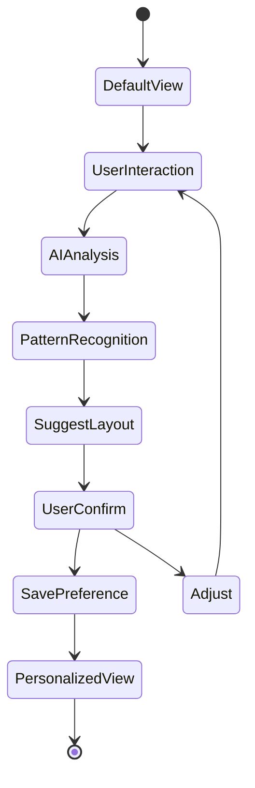
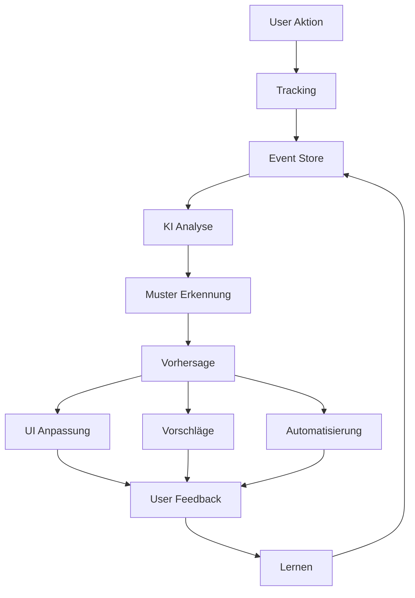
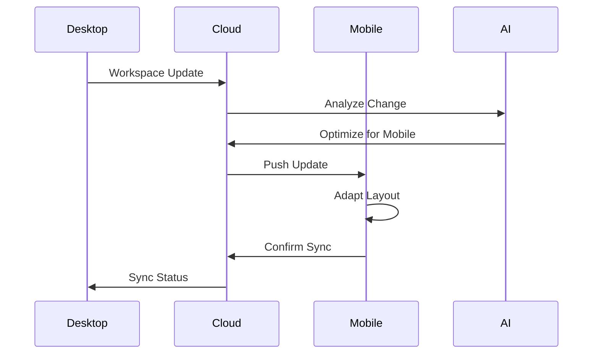

# User Flows & Interaction Design

## Inhaltsverzeichnis

- [Overview](#overview)
- [Core Interaction Principles](#core-interaction-principles)
  - [1. Adaptive Interface](#1-adaptive-interface)
  - [2. KI-Integration](#2-ki-integration)
- [Primary User Flows](#primary-user-flows)
- [Flow 1: Onboarding & Initial Setup](#flow-1-onboarding--initial-setup)
- [Flow 2: Email Dashboard Interaktion](#flow-2-email-dashboard-interaktion)
- [Flow 3: KI-Assistent Interaktion](#flow-3-ki-assistent-interaktion)
- [Flow 4: Email Composition mit KI](#flow-4-email-composition-mit-ki)
- [Flow 5: Smart Search & Filter](#flow-5-smart-search--filter)
- [Flow 6: Workspace Personalisierung](#flow-6-workspace-personalisierung)
- [Flow 7: KI Learning & Adaptation](#flow-7-ki-learning--adaptation)
- [Flow 8: Multi-Device Synchronisation](#flow-8-multi-device-synchronisation)
- [Interface State Management](#interface-state-management)
- [Adaptive UI Components](#adaptive-ui-components)
- [Performance & Optimization](#performance--optimization)
- [Privacy & Security Considerations](#privacy--security-considerations)
- [Next Steps](#next-steps)

## In diesem Dokument

- **[Overview](#overview)**: Einführung in KI-gesteuerte Email-Interaktion
- **[Core Principles](#core-interaction-principles)**: Adaptive Interface und KI-Integration
- **[Primary Flows](#primary-user-flows)**: Onboarding, Dashboard, KI-Assistent und Composition
- **[Advanced Flows](#flow-5-smart-search--filter)**: Smart Search, Personalisierung und Learning
- **[Technical Implementation](#interface-state-management)**: State Management und UI-Komponenten
- **[Optimization](#performance--optimization)**: Performance und Caching-Strategien
- **[Privacy](#privacy--security-considerations)**: Datenschutz und Sicherheit

## Verwandte Dokumente

- **[Authentifizierung](./AUTHENTICATION.md)**: Auth-basierte Benutzerinteraktionen
- **[Auth-Flows](./AUTH_FLOWS.md)**: Detaillierte Authentifizierungs-Abläufe
- **[KI-Agenten](./ai-agents.md)**: Agent-Implementierungen
- **[AI-Interaktions-Regeln](./ai-interaction-rules.md)**: KI-Interaktionslogik
- **[Entwicklung](./DEVELOPMENT.md)**: Entwicklungsrichtlinien
- **[Internationalisierung](./internationalization.md)**: Mehrsprachige UI

## Overview

MailMind ist eine KI-gesteuerte Email-Anwendung, die sich dynamisch an Benutzeranforderungen anpasst und intelligente Interaktionsmuster bietet.

## Core Interaction Principles

### 1. Adaptive Interface
- **Kontext-basierte Anpassung**: Interface passt sich basierend auf User-Aktivität an
- **KI-Vorhersagen**: Proaktive UI-Änderungen basierend auf erkannten Mustern
- **Personalisierung**: Individuelle Layouts pro Benutzer gespeichert

### 2. KI-Integration
- **Natürliche Sprache**: Befehle in natürlicher Sprache
- **Kontextuelle Assistenz**: KI versteht Email-Kontext
- **Proaktive Vorschläge**: Automatische Aktionsempfehlungen

## Primary User Flows

## Flow 1: Onboarding & Initial Setup



### Detaillierte Schritte:

1. **Welcome Experience**
   - Erklärt Kernfunktionen
   - Zeigt KI-Capabilities
   - Privacy & Security Info

2. **Email Account Setup**
   - Auto-Detect IMAP Settings
   - Multiple Account Support
   - Folder Mapping

3. **KI Personalisierung**
   - Fragt nach Präferenzen
   - Lernt aus ersten Interaktionen
   - Setzt initiale Kategorien

## Flow 2: Email Dashboard Interaktion



### Dashboard Features:

#### Adaptive Layout System
```typescript
interface DashboardLayout {
  mode: 'list' | 'grid' | 'focus' | 'kanban'
  panels: {
    navigation: PanelConfig
    emailList: PanelConfig
    preview: PanelConfig
    aiAssistant: PanelConfig
  }
  userPreferences: {
    density: 'compact' | 'comfortable' | 'spacious'
    theme: 'light' | 'dark' | 'auto'
    aiSuggestions: 'aggressive' | 'balanced' | 'minimal'
  }
}
```

## Flow 3: KI-Assistent Interaktion



### KI-Befehle Beispiele:

#### Natürliche Sprache Commands
- "Zeige alle Emails von heute die wichtig sind"
- "Fasse die Diskussion mit Max zusammen"
- "Erstelle eine Todo-Liste aus meinen Emails"
- "Plane Meetings basierend auf Email-Anfragen"

#### Interface Anpassungen
```javascript
// KI Response Format
{
  "command": "filter_important_today",
  "ui_changes": {
    "filter": {
      "date": "today",
      "priority": "high"
    },
    "layout": "focus",
    "highlight": ["urgent", "deadline"],
    "sidebar": {
      "show": true,
      "content": "ai_insights"
    }
  },
  "data": {
    "emails": [...],
    "insights": {
      "urgent_count": 3,
      "requires_response": 5,
      "meetings_proposed": 2
    }
  },
  "suggestions": [
    {
      "type": "quick_reply",
      "email_id": "123",
      "draft": "..."
    }
  ]
}
```

## Flow 4: Email Composition mit KI



### Composition Features:

#### Smart Compose
```typescript
interface SmartCompose {
  context: {
    replyTo?: EmailThread
    recipients: Contact[]
    subject: string
    previousDrafts: Draft[]
  }
  
  aiSuggestions: {
    templates: Template[]
    toneOptions: ['formal', 'casual', 'urgent', 'friendly']
    contentBlocks: ContentBlock[]
    attachments: SuggestedFile[]
  }
  
  realTimeAssist: {
    grammar: boolean
    tone: boolean
    completeness: boolean
    factChecking: boolean
  }
}
```

## Flow 5: Smart Search & Filter



### Such-Beispiele:
- "Emails mit Anhängen größer als 5MB"
- "Unbeantwortete Emails älter als 3 Tage"
- "Diskussionen über Projekt Alpha"
- "Emails die eine Entscheidung brauchen"

## Flow 6: Workspace Personalisierung



### Workspace Speicherung:

#### User Preferences Schema
```typescript
interface UserWorkspace {
  id: string
  userId: string
  
  layouts: {
    default: LayoutConfig
    contexts: {
      morning: LayoutConfig
      focus: LayoutConfig
      review: LayoutConfig
      planning: LayoutConfig
    }
  }
  
  aiSettings: {
    autoSuggest: boolean
    proactiveActions: boolean
    learningEnabled: boolean
    privacyLevel: 'full' | 'limited' | 'minimal'
  }
  
  shortcuts: {
    keyboard: KeyboardShortcut[]
    quickActions: QuickAction[]
    savedSearches: SavedSearch[]
  }
  
  automations: {
    rules: AutomationRule[]
    triggers: Trigger[]
    workflows: Workflow[]
  }
}
```

## Flow 7: KI Learning & Adaptation



### Learning Pipeline:

#### Event Tracking
```javascript
// Tracked Events
{
  "event_type": "email_action",
  "timestamp": "2024-01-15T10:30:00Z",
  "context": {
    "email_category": "work",
    "time_of_day": "morning",
    "action": "archive",
    "read_time": 45,
    "ui_state": {
      "layout": "list",
      "filters": ["unread"],
      "sort": "date_desc"
    }
  },
  "outcome": {
    "followed_suggestion": true,
    "efficiency_score": 0.85
  }
}
```

## Flow 8: Multi-Device Synchronisation



## Interface State Management

### State Persistence Strategy

#### Local Storage
```typescript
// Immediate UI State
localStorage.setItem('ui_state', JSON.stringify({
  layout: currentLayout,
  filters: activeFilters,
  openPanels: panelStates,
  lastActivity: timestamp
}))
```

#### Session Storage
```typescript
// Temporary State
sessionStorage.setItem('draft_state', JSON.stringify({
  unsavedDrafts: drafts,
  activeCompose: composeState,
  aiConversation: conversationHistory
}))
```

#### Backend Persistence
```typescript
// Long-term Preferences
await api.post('/user/preferences', {
  workspace: workspaceConfig,
  aiSettings: aiPreferences,
  automations: userAutomations,
  shortcuts: customShortcuts
})
```

## Adaptive UI Components

### Dynamic Panel System
```typescript
interface AdaptivePanel {
  id: string
  type: 'email_list' | 'preview' | 'ai_assistant' | 'calendar'
  
  state: {
    visible: boolean
    size: 'minimized' | 'normal' | 'maximized'
    position: 'left' | 'right' | 'bottom' | 'floating'
    locked: boolean
  }
  
  triggers: {
    showOn: TriggerCondition[]
    hideOn: TriggerCondition[]
    resizeOn: TriggerCondition[]
  }
  
  content: {
    type: 'static' | 'dynamic'
    source: 'email' | 'ai' | 'calendar' | 'tasks'
    filters: any
  }
}
```

### Context-Aware Toolbar
```typescript
interface SmartToolbar {
  context: EmailContext | ComposeContext | SearchContext
  
  actions: {
    primary: Action[]    // Meist genutzte Actions
    secondary: Action[]  // Kontext-spezifische Actions
    ai: AIAction[]      // KI-vorgeschlagene Actions
  }
  
  adapt: {
    hideUnused: boolean
    learnFromUsage: boolean
    suggestNew: boolean
  }
}
```

## Performance & Optimization

### Lazy Loading Strategy
- Initial Load: Nur kritische UI-Komponenten
- Progressive Enhancement: Features nach Bedarf laden
- Predictive Preloading: KI lädt voraussichtlich benötigte Features

### Caching Strategy
- UI State: 24h local cache
- User Preferences: Permanent storage
- AI Suggestions: 1h cache mit smart invalidation
- Email Data: Incremental sync

## Privacy & Security Considerations

### Data Handling
- **Local First**: Preferences lokal gespeichert
- **Encrypted Sync**: Verschlüsselte Übertragung
- **Selective Sharing**: User kontrolliert KI-Zugriff
- **Audit Trail**: Alle KI-Aktionen protokolliert

### User Control
```typescript
interface PrivacySettings {
  ai: {
    enableLearning: boolean
    shareAnonymizedData: boolean
    localProcessingOnly: boolean
  }
  
  storage: {
    cloudSync: boolean
    encryptionLevel: 'standard' | 'enhanced'
    dataRetention: number // days
  }
  
  tracking: {
    analytics: boolean
    performanceMetrics: boolean
    errorReporting: boolean
  }
}
```

## Next Steps

1. **Wireframe Creation**: Detailed mockups für jeden Flow
2. **Prototype Development**: Interactive prototypes
3. **User Testing**: A/B Testing der Flows
4. **KI Training**: Personalisierungs-Algorithmen
5. **Implementation**: Schrittweise Umsetzung